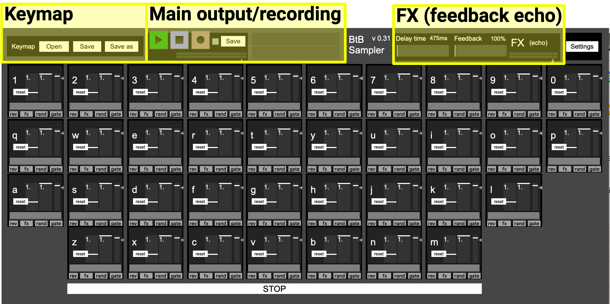
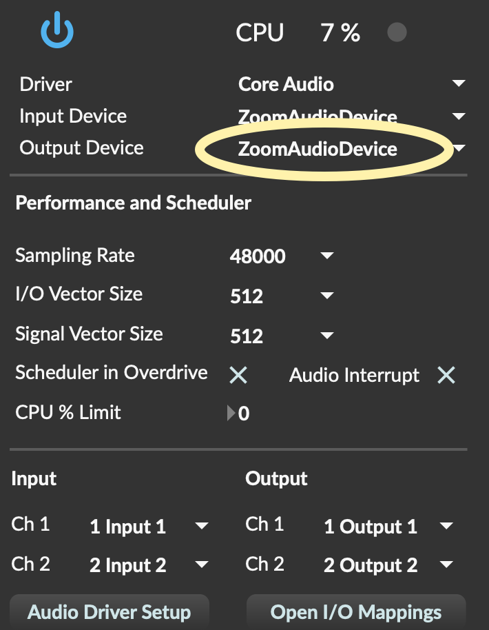

# BtB-Sampler
This is a prototype soundboard for online sound art/music workshops, created in Max.

This sampler was created for [blurringtheboundaries.org](http://blurringtheboundaries.org/) (BtB Arts) and has been developed through [City Lit Sonic Arts](https://www.citylit.ac.uk/courses/sonic-arts-creativity-with-sound/) and [Music Boat](https://musicboat.org/taster-workshop-in-collaborative-sonic-art/).  I've uploaded this work in progress with minimal instructions for now, but eventually hope to have something a lot more accessible here!

# Instructions

## Installation

For the current version, a copy of [Cycling '74 Max](https://cycling74.com/downloads) is required.

- Download the latest release ([link here](https://github.com/matthewscharles/BtB-Sampler/releases)) and unzip to reveal a .mxf file.  
- Load this file with Max.

*These instructions are for version 0.1 - update in progress!*

## Loading samples

Drag a sound file (.aif or .wav - some mp3s may work) onto the key you want to use.

Click on the toggles to set parameters:

- fx send: whether or not the sound plays through the delay unit
- gate: whether the sound plays only when the key is pressed (gated), or continues all the way through once the key is released.
- rand: randomised pitch
- rev: reversed (play the sample backwards)

Drag the three sliders to set further details:

- Pitch: the sample playback rate will be multiplied by this number (e.g. 0.5 = half speed, 2 = double speed)
- Filter: choose lower numbers to muffle the sound

Set the sample start and end time:

- Drag over the waveform to set the start and end time of the sound.

## Keymap

Save the key allocations as a text file to load next time (note the sound files will not be saved with this if you take it to another computer).

## FX: delay

This effect creates an echo trail by sending sounds into a delayed feedback loop.

Choose the delay time (the length of the echo in milliseconds) and feedback (how much of the echo is fed back into the loop, determining the length of the echo trail).

## Recording

Press the rec button to record -- press again to stop.

## Selecting the output device

Click on **settings** to choose where to route the audio (e.g. your built in speakers, an external output, or Zoom). 

Audio should work immediately with the built in output.

Choose “ZoomAudioDevice” to have audio play over Zoom.